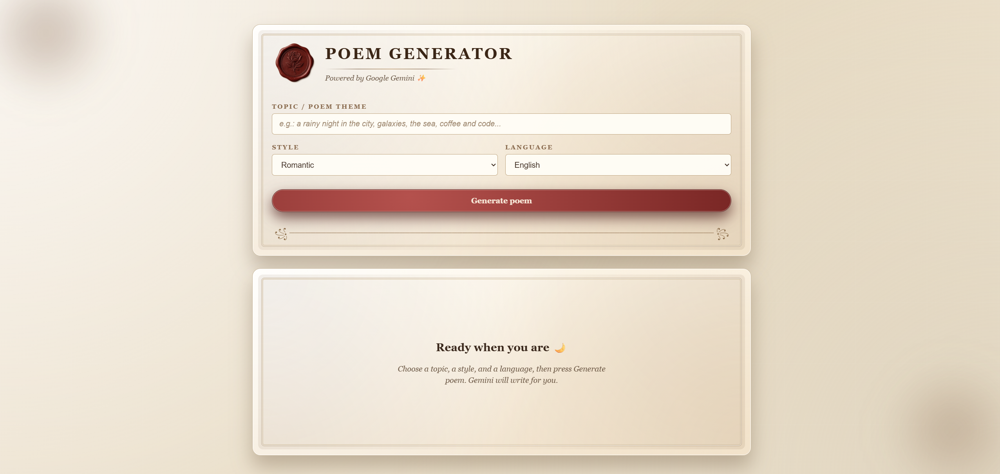

<p align="center">
  
</p>

<h1 align="center">Dreambook Poem Maker · Vintage AI Poem Generator</h1>

<p align="center">
  
  
  
  
  
  
</p>

---


# 📜 Poem Generator – AI Poetry in an Old Book UI

A vintage, old-book styled poem generator powered by **Google Gemini**.  
Choose a topic, style, and language, then let the model write a poem for you in a romantic, elegant interface that looks like a classic book page.

## 📸 Preview
<p align='center'>
    
</p>

## ✨ Features

- 🎨 **Vintage book UI** – parchment background, page-like cards, bookmark ribbon
- 🧠 **AI-powered poems** – generated using Google Gemini API
- 🌍 **Multi-language support** – English, Romanian, French, Spanish
- 🎭 **Multiple styles** – romantic, sad/melancholic, funny, motivational, haiku, dark/dramatic
- 📜 **Scrollable poem output** – long poems stay inside a scrollable page area

---

## 🛠 Tech Stack

- **Frontend:** React + Vite
- **Styling:** Custom CSS (vintage old-book aesthetic)
- **Backend:** Node.js + Express
- **AI:** Google Generative AI (Gemini)
- **Other:** dotenv, CORS

---

## 🚀 Getting Started (Local)

### 1. Clone the repository

```bash
git clone https://github.com/USERNAME/poem-generator.git
cd poem-generator-with-google-gemini
```

### 2. Install frontend dependencies

```bash
npm install
```

### 3. Install backend dependencies

```bash
cd server
npm install
cd ..
```

### 4. Configure environment variables

```bash
GEMINI_API_KEY=your_google_gemini_api_key_here
PORT=5000
```
>⚠️ Note: Never commit your real API key.

### 5. Run the backend
In a terminal:
```bash
cd server
node index.js
```

### 6. Run the frontend
In another terminal (from the root of the project):
```bash
cd ..
npm run dev
```

Open it in your browser and start generating poems. ✨